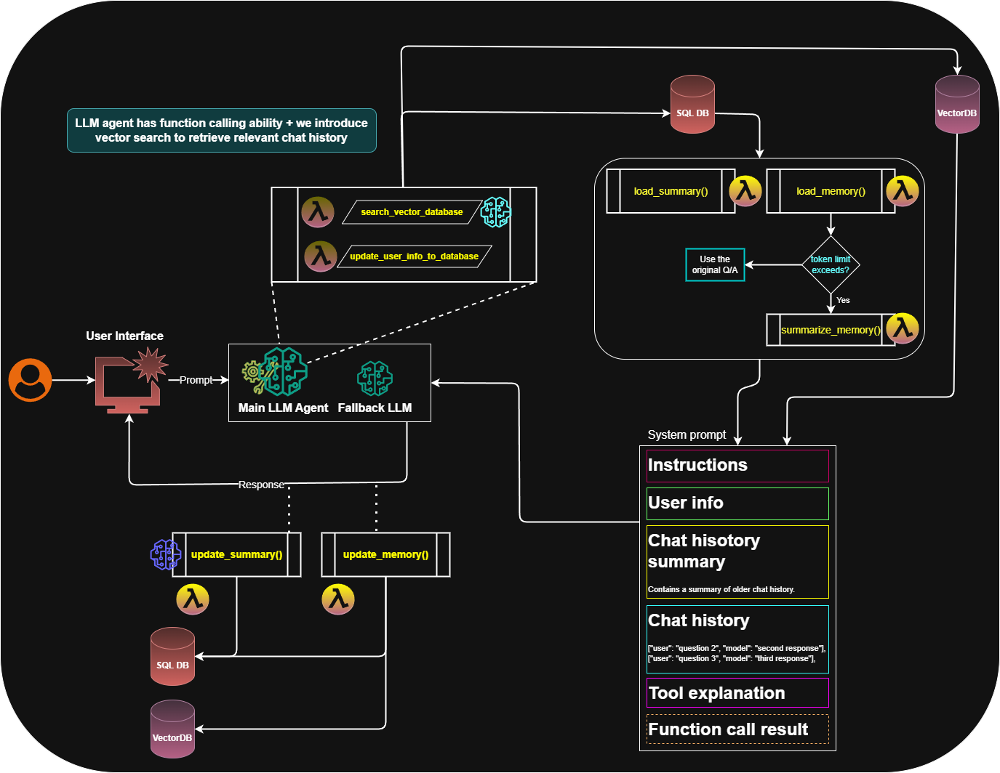

# 🧠 Agentic Chatbot v3 — With Long-Term Semantic Memory

This third version builds on the agentic design of v2, but adds a powerful new layer:  
**vector database integration** for semantic memory.

With this, the chatbot becomes more context-aware, capable of retrieving relevant past conversations even if the wording is different.  
It simulates long-term memory, something that wasn't possible in the earlier versions.

---

## 🔍 Core Functionalities

### 1. 🧱 Initialization

As before, the chatbot loads all the foundational components:
- OpenAI client
- Configurations
- Session ID
- SQL-based managers

But now it adds:
- **`VectorDBManager`** — connects to a vector database (e.g., Chroma) for storing and retrieving embeddings of past conversations.

It also updates the list of tools (functions the agent can call) to include:
- `add_user_info_to_database`
- `search_vector_db` (replacing `search_chat_history` from v2)

---

### 2. ⚙️ Function Execution

The chatbot supports OpenAI function calling.  
Now, when the model asks to search memory, it can do so **semantically** using vector similarity rather than keyword matching.

This leads to more relevant, nuanced, and context-aware behavior.

---

### 3. 🔁 Conversational Loop

Same looping architecture as v2:
- The chatbot keeps prompting the model until a final response is ready
- It handles tool calls, updates chat history, and builds a dynamic system prompt using:
  - User info
  - Chat summary
  - Chat history
  - Function call results
  - And now: vector memory!

The system prompt uses a new builder:  
`prepare_system_prompt_for_agentic_chatbot_v2` — designed to support semantic memory and vector search results.

---

### 4. 🧠 Vector Memory Update

After every conversation:

```python
msg_pair = f"user: {user_message}, assistant: {assistant_response}"
self.vector_db_manager.update_vector_db(msg_pair)
```
This message pair is embedded and stored in the vector database.

That means the next time the user asks a related question, the chatbot can recall this past exchange even if it's phrased differently.

---

## 🔄 Key Differences from the Previous Versions

| Feature | **V1: Basic Chatbot** | **V2: Agentic Chatbot** | **V3: Vector-Aware Agentic Chatbot (This)** |
|--------|-----------------------|--------------------------|--------------------------------------------|
| **Chat Flow** | Simple Q&A | Agent loop with function calls | Agent loop with memory + vector updates |
| **Function Calling** | ❌ None | ✅ Basic agent functions | ✅ Includes vector DB search |
| **Tools** | None | `add_user_info_to_database`, `search_chat_history` | `add_user_info_to_database`, `search_vector_db` |
| **Search Capability** | ❌ None | ✅ Keyword/phrase-based search on SQL database (not semantic) | ✅ Semantic search using vector embeddings (stored in a vector database) |
| **Prompt Strategy** | Simple prompt | Prompt with function call context | Prompt with function call context
| **Fallback Strategy** | ❌ None | ✅ Includes a fallback mechanism| ✅ Includes a fallback mechanism|
| **Memory System** | Chat history + summary | Chat history + summary + **SQL db search result** | Chat hirsoty + summary + **long-term memory (vector DB)** |
| **System Prompt** | `prepare_system_prompt` | `prepare_system_prompt_for_agentic_chatbot_v1` | `...v2` with vector support context |
| **Knowledge Retention** | Temporary, short-term | Contextually limited | **Semantically indexed for long-term reasoning** |

---

## 🧠 Final Thoughts

This chatbot represents a **hybrid agent** — blending dynamic tool use with smart, long-term memory.

It:
- Understands conversations across sessions
- Grows more intelligent over time
- Uses semantic reasoning to bring relevant context into its responses

This is the blueprint for building **truly intelligent assistants** — not just reactive models, but adaptive agents.

---

## 🧾 Architecture Overview

Here's the architecture of Agentic Chatbot v3:

